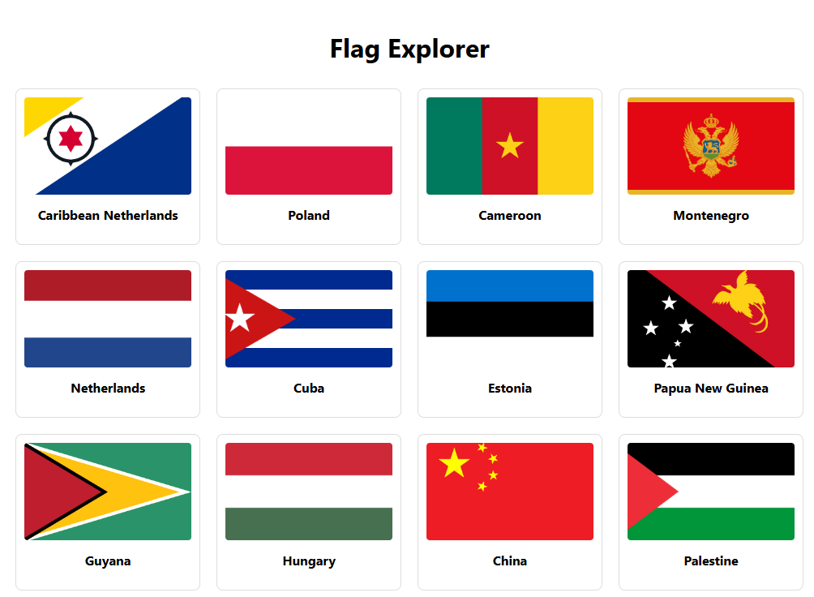

# Flag Explorer App



A full-stack application to explore country flags and details, built with Spring Boot backend and React frontend.

## Features

- Browse all country flags in a responsive grid
- View detailed country information (name, capital, population)
- Clean, modern user interface
- RESTful API backend
- CI/CD pipeline integration

## Technologies Used

### Backend
- Java 17
- Spring Boot 3.x
- REST Countries API
- Maven

### Frontend
- React 18
- Axios for API calls
- React Router for navigation
- CSS Grid/Flexbox for layout

## Getting Started

### Prerequisites

- Java JDK 17
- Node.js 16+
- npm or yarn
- Maven

### Installation

1. Clone the repository:
   ```bash
   git clone https://github.com/your-username/flag-explorer-app.git
   cd flag-explorer-app
   ```

2. Set up the backend:
   ```bash
   cd backend
   mvn clean install
   ```

3. Set up the frontend:
   ```bash
   cd ../frontend
   npm install
   ```

### Running the Application

1. Start the backend:
   ```bash
   cd backend
   mvn spring-boot:run
   ```
   The backend will run on `http://localhost:8080`

2. Start the frontend (in a new terminal):
   ```bash
   cd frontend
   npm start
   ```
   The frontend will open in your browser at `http://localhost:3000`

## Configuration

### Environment Variables

Backend (in `application.properties`):
```properties
server.port=8080
```

Frontend (create `.env` file):
```env
REACT_APP_API_BASE_URL=http://localhost:8080
```

## API Endpoints

| Endpoint | Method | Description |
|----------|--------|-------------|
| `/countries` | GET | Get all countries |
| `/countries/{name}` | GET | Get details for a specific country |

## Project Structure

```
flag-explorer-app/
├── backend/
│   ├── src/main/java/com/explorer/flag/
│   │   ├── controller/    # REST controllers
│   │   ├── model/         # Data models
│   │   ├── service/       # Business logic
│   │   └── FlagExplorerApplication.java
│   ├── pom.xml            # Maven config
│   └── application.properties
├── frontend/
│   ├── public/            # Static files
│   ├── src/               # React source
│   │   ├── components/    # UI components
│   │   ├── pages/         # Page components
│   │   ├── services/      # API services
│   │   ├── App.js         # Main component
│   │   └── index.js       # Entry point
│   └── package.json       # npm dependencies
└── .github/workflows/     # CI/CD pipelines
```

## CI/CD Pipeline

The GitHub Actions workflow includes:
- Automated testing for backend and frontend
- Build and package the application
- Deployment (configure your deployment target)

## Screenshots


*Country details page*

## Contributing

1. Fork the project
2. Create your feature branch (`git checkout -b feature/AmazingFeature`)
3. Commit your changes (`git commit -m 'Add some amazing feature'`)
4. Push to the branch (`git push origin feature/AmazingFeature`)
5. Open a Pull Request

## License

Distributed under the MIT License. See `LICENSE` for more information.
